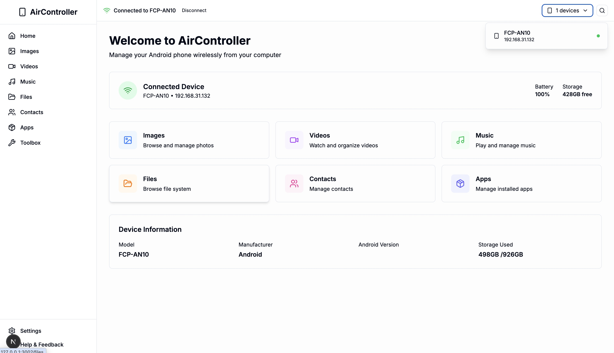

# AirController Web

[English](#english) | [中文](#中文)

---

## English

### Introduction

AirController Web is the web version of [AirController Desktop](https://github.com/ly0/air-controller-desktop/), allowing you to wirelessly manage your Android phone from your browser.

**Related Projects:**

- 🖥️ Desktop Version: [air-controller-desktop](https://github.com/ly0/air-controller-desktop/)
- 📱 Mobile App: [air-controller-mobile](https://github.com/ly0/air-controller-mobile)

### TL;DR

```bash
git clone https://github.com/ly0/aircontroller-web.git
cd aircontroller-web
npm install
npm run dev:all
# Open http://localhost:3000 and connect your phone
```

### Screenshot



### Features

- 📸 **Images** - Browse and manage photos on your phone
- 🎬 **Videos** - Watch and organize videos
- 🎵 **Music** - Play and manage music files
- 📁 **Files** - Browse and manage file system
- 👥 **Contacts** - View and manage contacts
- 📦 **Apps** - Manage installed applications
- 🔋 **Device Info** - View battery, storage, and device information
- 📄 **PDF Viewer** - View PDF files directly in browser

### Tech Stack

- **Framework**: Next.js 15 (with Turbopack)
- **UI Library**: React 19
- **Language**: TypeScript
- **Styling**: TailwindCSS 4
- **State Management**: Zustand
- **Communication**: WebSocket (ws)
- **Data Fetching**: TanStack Query
- **Forms**: React Hook Form + Zod
- **Icons**: Lucide React

### Requirements

- Node.js 20+
- An Android phone with [AirController Mobile](https://github.com/ly0/air-controller-mobile) installed
- Both devices connected to the same network

### Quick Start

1. **Clone the repository**
   ```bash
   git clone https://github.com/ly0/aircontroller-web.git
   cd aircontroller-web
   ```

2. **Install dependencies**
   ```bash
   npm install
   ```

3. **Run development server**
   ```bash
   # Run both web app and WebSocket server
   npm run dev:all

   # Or run separately
   npm run dev      # Web app only
   npm run server   # WebSocket server only
   ```

4. **Open in browser**
   ```
   http://localhost:3000
   ```

5. **Connect your phone**
   - Install [AirController Mobile](https://github.com/ly0/air-controller-mobile) on your Android phone
   - Make sure your phone and computer are on the same network
   - Open the mobile app and connect to the web interface

### Development Scripts

```bash
npm run dev          # Start Next.js development server
npm run server       # Start WebSocket server
npm run server:dev   # Start WebSocket server with hot reload
npm run dev:all      # Start both web and server concurrently
npm run build        # Build for production
npm run start        # Start production server
npm run lint         # Run ESLint
```

### Project Structure

```
aircontroller-web/
├── app/              # Next.js app router pages
│   ├── apps/        # Apps management page
│   ├── contacts/    # Contacts page
│   ├── files/       # File browser page
│   ├── images/      # Image gallery page
│   └── videos/      # Video player page
├── components/      # React components
│   ├── layout/      # Layout components
│   └── ui/          # UI components
├── server/          # WebSocket server
├── store/           # Zustand state management
└── services/        # Service layer
```

### Contributing

This project is under active development. We welcome contributions!

- 🐛 Found a bug? [Open an issue](https://github.com/ly0/aircontroller-web/issues)
- 💡 Have a feature request? [Open an issue](https://github.com/ly0/aircontroller-web/issues)
- 🔧 Want to contribute? Pull requests are welcome!

### License

MIT

---

## 中文

### 项目介绍

AirController Web 是 [AirController Desktop](https://github.com/ly0/air-controller-desktop/) 的 Web 版本，允许你通过浏览器无线管理你的 Android 手机。

**相关项目：**

- 🖥️ 桌面版：[air-controller-desktop](https://github.com/ly0/air-controller-desktop/)
- 📱 手机端：[air-controller-mobile](https://github.com/ly0/air-controller-mobile)

### 快速上手

```bash
git clone https://github.com/ly0/aircontroller-web.git
cd aircontroller-web
npm install
npm run dev:all
# 在浏览器打开 http://localhost:3000 并连接手机
```

### 项目截图


### 功能特性

- 📸 **图片管理** - 浏览和管理手机中的照片
- 🎬 **视频管理** - 观看和整理视频文件
- 🎵 **音乐管理** - 播放和管理音乐文件
- 📁 **文件浏览** - 浏览和管理文件系统
- 👥 **联系人管理** - 查看和管理联系人
- 📦 **应用管理** - 管理已安装的应用程序
- 🔋 **设备信息** - 查看电池、存储和设备信息
- 📄 **PDF 查看器** - 直接在浏览器中查看 PDF 文件

### 技术栈

- **框架**: Next.js 15 (使用 Turbopack)
- **UI 库**: React 19
- **开发语言**: TypeScript
- **样式方案**: TailwindCSS 4
- **状态管理**: Zustand
- **通信协议**: WebSocket (ws)
- **数据请求**: TanStack Query
- **表单处理**: React Hook Form + Zod
- **图标库**: Lucide React

### 环境要求

- Node.js 20+
- 安装了 [AirController Mobile](https://github.com/ly0/air-controller-mobile) 的 Android 手机
- 手机和电脑连接到同一网络

### 快速开始

1. **克隆仓库**
   ```bash
   git clone https://github.com/ly0/aircontroller-web.git
   cd aircontroller-web
   ```

2. **安装依赖**
   ```bash
   npm install
   ```

3. **启动开发服务器**
   ```bash
   # 同时运行 Web 应用和 WebSocket 服务器
   npm run dev:all

   # 或分别运行
   npm run dev      # 仅 Web 应用
   npm run server   # 仅 WebSocket 服务器
   ```

4. **在浏览器中打开**
   ```
   http://localhost:3000
   ```

5. **连接手机**
   - 在 Android 手机上安装 [AirController Mobile](https://github.com/ly0/air-controller-mobile)
   - 确保手机和电脑在同一网络下
   - 打开手机应用并连接到 Web 界面

### 开发命令

```bash
npm run dev          # 启动 Next.js 开发服务器
npm run server       # 启动 WebSocket 服务器
npm run server:dev   # 启动 WebSocket 服务器（支持热重载）
npm run dev:all      # 同时启动 Web 和服务器
npm run build        # 构建生产版本
npm run start        # 启动生产服务器
npm run lint         # 运行 ESLint
```

### 项目结构

```
aircontroller-web/
├── app/              # Next.js app router 页面
│   ├── apps/        # 应用管理页面
│   ├── contacts/    # 联系人页面
│   ├── files/       # 文件浏览器页面
│   ├── images/      # 图片库页面
│   └── videos/      # 视频播放器页面
├── components/      # React 组件
│   ├── layout/      # 布局组件
│   └── ui/          # UI 组件
├── server/          # WebSocket 服务器
├── store/           # Zustand 状态管理
└── services/        # 服务层
```

### 参与贡献

项目正在积极开发中，欢迎贡献！

- 🐛 发现 Bug？[提交 Issue](https://github.com/ly0/aircontroller-web/issues)
- 💡 有功能建议？[提交 Issue](https://github.com/ly0/aircontroller-web/issues)
- 🔧 想要贡献代码？欢迎提交 Pull Request！

### 开源协议

MIT
